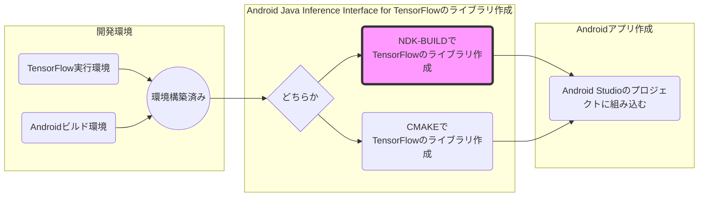

Androidアプリ開発環境でTensorFlowの学習済みグラフ(プロトコルバッファ形式のモデル)を読み込み実行するまで


Android Java Inference Interface for TensorFlowをBazelでbuildして、so, jarファイルを生成。

# Android Java Inference Interface for TensorFlow

https://github.com/tensorflow/tensorflow/tree/master/tensorflow/contrib/android

```shell
$ git clone --recurse-submodules https://github.com/tensorflow/tensorflow.git
```

## WORKSPACEの設定

tensorflowフォルダに移動し、WORKSPACEファイルを編集する。

```
$ cd tensorflow
$ ls -l WORKSPACE
```
WORKSPACEの`android_sdk_repository`, `android_ndk_repository`を自分の環境に合わせる。`android_sdk_repository`のapi_levelとbuild_tools_versionをAndroid Studioの環境に合わせる。
tensorflowのdemoはbuild要求がAPI LEVEL 23以上、実行環境がAPI LEVEL 21以上(Android 5.0以上)となっています
#####android_sdk_repository
api_level: 開発環境でインストールしたplatformsのバージョン。tensorflow/contrib/android/cmake/build.gradleが24を指定しているので開発環境にはplatforms;android-24を入れておきます。
build_tools_version: 開発環境でインストールしたbuild-toolsのバージョン。build-tools;25.0.2なら"25.0.2"
#####android_ndk_repository
api_level: 21のまま

WORKSPACE
```
android_sdk_repository(
    name = "androidsdk",
    api_level = 24,
    build_tools_version = "25.0.2",
    # Replace with path to Android SDK on your system
    path = "/Users/sasakiakira/Library/Android/sdk/",
)

android_ndk_repository(
    name="androidndk",
    path="/Users/sasakiakira/Library/Android/sdk/ndk-bundle/",
    api_level=21)
```

## libtensorflow_inference.soのBuild

```shell
$ bazel build -c opt //tensorflow/contrib/android:libtensorflow_inference.so \
   --crosstool_top=//external:android/crosstool \
   --host_crosstool_top=@bazel_tools//tools/cpp:toolchain \
   --cpu=armeabi-v7a
もしエラーが出るようならビルド中にリソース不足の可能性があるので、リソース制限オプションを使う
$ bazel build -c opt //tensorflow/contrib/android:libtensorflow_inference.so \
   --crosstool_top=//external:android/crosstool \
   --host_crosstool_top=@bazel_tools//tools/cpp:toolchain \
   --cpu=armeabi-v7a \
   --jobs 1 \
   --local_resources 2048,0.5,1.0 \
   --verbose_failures
```

これで、libtensorflow_inference.so が生成される

```shell
$ ls bazel-bin/tensorflow/contrib/android/libtensorflow_inference.so
```

|ファイル名||
|:--|:--|
|libandroid_tensorflow_lib.lo|core TensorFlow runtime + ops for linking into other libraries|
|libtensorflow_inference.so|core TF runtime+ops with added JNI bindings|


## libandroid_tensorflow_inference_java.jarのBuild

```
$ bazel build //tensorflow/contrib/android:android_tensorflow_inference_java
```

これで、libandroid_tensorflow_inference_java.jarが生成される

```
$ ls bazel-bin/tensorflow/contrib/android/libandroid_tensorflow_inference_java.jar
```

# ヒント

https://github.com/tensorflow/tensorflow/issues/6356

Build.gradle
https://github.com/tensorflow/tensorflow/blob/master/tensorflow/examples/android/build.gradle

