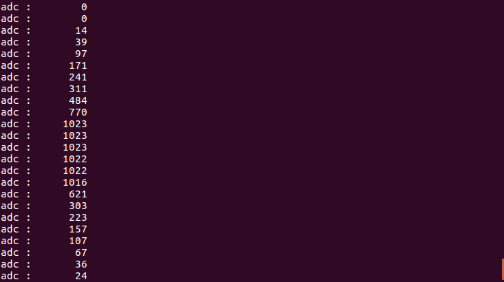

# Jetson TX2 環境構築

## Jetson TX2 JetPack 3.2 環境構築方法
> \# After JetPack 3.2 installation  
> \# ssh login to TX2  
> ssh ubuntu@192.168.x.x  
> 
> sudo su  
> cd setup_scripts  
> ./setup.sh  
> \#wait reboot  
> 
> sudo su  
> cd install_scripts  
> ./install.sh  
> \#wait 2 hours  

## 内容
 * #### 初期設定 (setup_scripts/setup.sh)
   * CPUファン自動起動 (setup_cpufun.sh)
   * Ubuntu 16.04 パッケージ更新 (setup_update.sh)
   * .bashrc書き換え (setup_bash.sh)
   * .dircolors追加 (setup_dircolors.sh)
   * SPIDev有効化 (setup_spi.sh)
   * reboot
 * #### TensorFlow r1.4.1 インストール (install_scripts/install.sh)
   * Ubuntu 16.04 パッケージ更新
   * Python 3.6.3 インストール(install_python3.6.sh)
   * pip3 インストール(install_pip3.sh)
   * jupyter インストール(install_jupyter.sh)
   * Java8 インストール(install_java8.sh)
   * Build Tools インストール(install_build_tools.sh)
   * CUDA deviceQuery ビルド (install_cuda_deviceQuery.sh)
   * patchを当てる (cv_patch.sh)
   * OpenCV 3.3.1 インストール (install_opencv-3.3.1.sh)
   * bazel 0.5.4 ビルド (build_bazel-0.5.4.sh)
   * TensorFlow r1.4.1 インストール (install_tensorflow-r1.4.1.sh)
   * TensorFlow c++ r1.4.1 インストール (install_tensorflow-cpp-r1.4.1.sh)
 * #### パッケージ作成
   * OpenCV 3.3.1 パッケージ作成 (build_opencv-3.3.1.sh)
   * OpenMPI 3.3.0 パッケージ作成 (build_openmpi-3.3.0.sh)
   * TensorFlow r1.4.1 pipパッケージ作成 (build_tensorflow-r1.4.1.sh)
   * TensorFlow c++ api r1.4.1 パッケージ作成 (build_tensorflow-cpp-api-r1.4.1.sh)

## Jupyter 起動方法
install_scripts/install_jupyter.shでTX2起動時に自動起動するように設定してある。  
初期パスワードはmypassword  
> env PASSWORD=mypassword jupyter notebook --allow-root --NotebookApp.iopub_data_rate_limit=10000000

## Jupyter アクセス方法
ブラウザでアクセスする。  
パスワードは起動時に環境変数に指定したmypassword  
> http://IPアドレス:8888/

## SPI動作確認
[Fabo](http://fabo.io)の[#104 Angle Brick](http://fabo.io/104.html)と#509 OUT/IN Shield for JETSON TX2 beta3で確認する。  
spi-sample.py
```
# coding: utf-8
# pip3 install spidev

import spidev
import time
import sys

spi = spidev.SpiDev()
# open: Connects the object to the specified SPI device. open(X,Y) will open /dev/spidev-X.Y
bus=3
device=0
spi.open(bus,device)

# SPI Settings
# max_speed_hz: Property that gets / sets the maximum bus speed in Hz.
# mode: Property that gets /sets the SPI mode as two bit pattern of Clock Polarity and Phase [CPOL|CPHA]. Range:0b00..0b11 (0..3)
spi.max_speed_hz = 5000
spi.mode=0b01

# A0コネクタに機器を接続
SPI_PIN_A0 = 0

#read SPI from the ADC(MCP3008 chip), 8 possible chanels
def readadc(channel):
    """
    Analog Data Converterの値を読み込む
    @channel チャンネル番号
    """    
    #Writes a list of values to SPI device.
    #bits_per_word: Property that gets / sets the bits per word.
    #xfer2(list of values[, speed_hz, delay_usec, bits_per_word])
    speed_hz = 1
    delay_usec = (8+channel)<<4
    bits_per_word = 0
    to_send = [speed_hz,delay_usec,bits_per_word]
    adc = spi.xfer2(to_send)

    data = ((adc[1]&3) << 8) + adc[2]
    return data

def map(x, in_min, in_max, out_min, out_max):
    """
    map関数
    @x 変換したい値
    @in_min 変換前の最小値
    @in_max 変換前の最大値
    @out_min 変換後の最小
    @out_max 変換後の最大値
    @return 変換された値
    """
    return (x - in_min) * (out_max - out_min) // (in_max - in_min) + out_min

try:
    while True:
        data = readadc(SPI_PIN_A0)
        value = map(data, 0, 1023, 0, 100)
        print("adc : {:8} ".format(data))
        
        time.sleep( 0.1 )
except KeyboardInterrupt:
    # close: Disconnects the object from the interface
    spi.close()
    sys.exit(0)
```
> python spi-sample.py




## 議論
 * TX2: メモリが豊富ではないので学習には向かない
 * TX2: GPUしか使わないのでSWAPは要らない
 * TensorFlow: JEMALLOC,CLA,CUDAを有効
 * TensorFlow: S3,GCP,HDFS,MPIを無効
 * TensorFlow: MKLはIntelなのでARMのTX2では使わない
 * TX2: DenverコアはOpenCVビルドに失敗するので使わない
 * TX2: パッケージはARM64で作成する