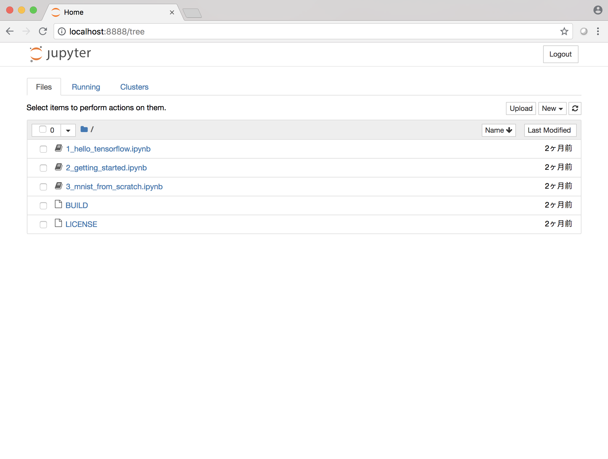

# 開発環境

TensorFlow等の実行環境は、Docker上に、TensorFlow + JupyterでLocalに構築します。

## Dockerのインストール

https://www.docker.com/

Docker Community Edition for Mac
https://store.docker.com/editions/community/docker-ce-desktop-mac

Docker Community Edition for Windows
https://store.docker.com/editions/community/docker-ce-desktop-windows

を各環境に合わせてインストールします。

## TensorFlow Dockerをインストール

Dockerのインストールが完了したら、マウスのDoubleクリックでDockerを起動し、DockerコマンドでTensorFlow Dockerをダウンロードしてきます。

> $ docker run -it -p 8888:8888 tensorflow/tensorflow

```
[C 16:50:37.847 NotebookApp] 
    
    Copy/paste this URL into your browser when you connect for the first time,
    to login with a token:
        http://localhost:8888/?token=#########################
```

localhost:8888に接続。上のリンクをコピーして接続する。



