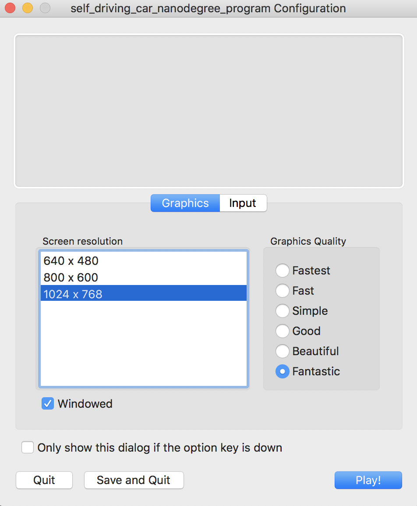
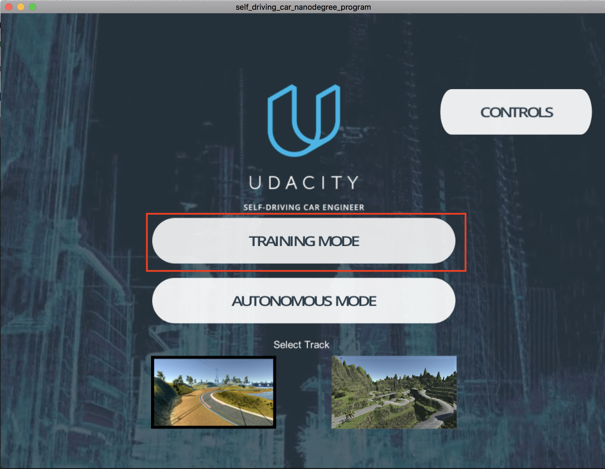
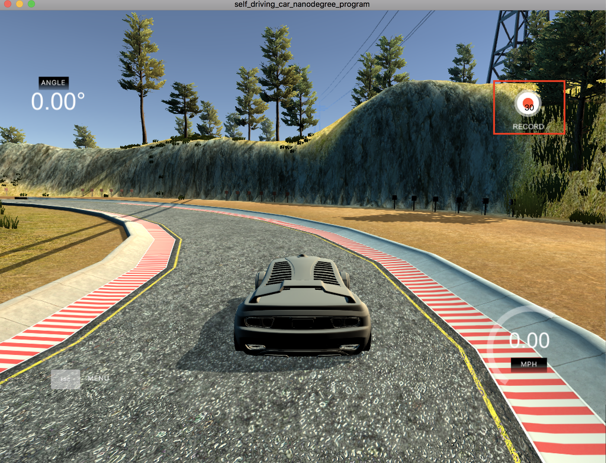
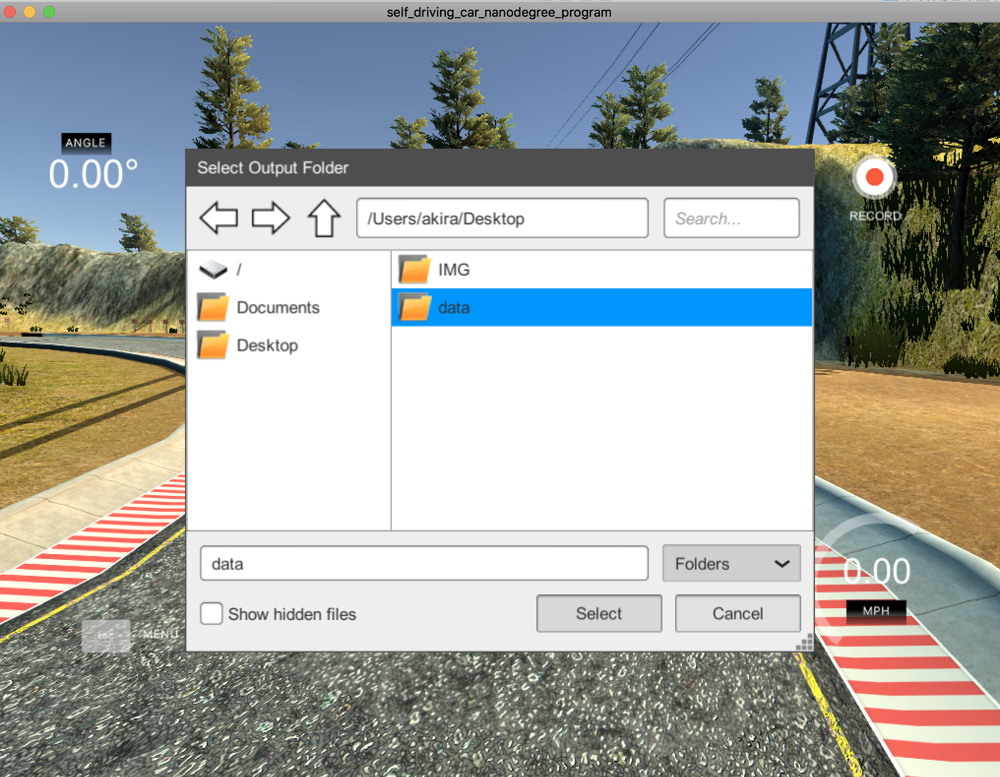
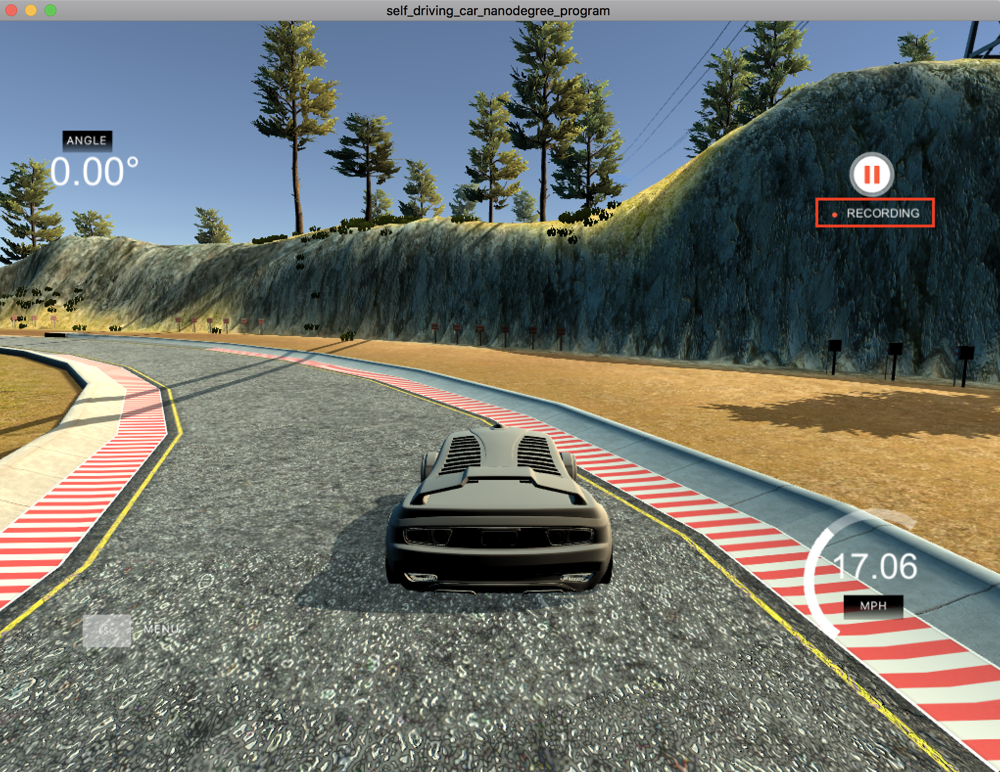
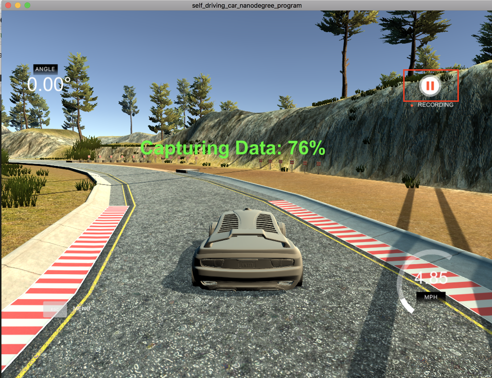
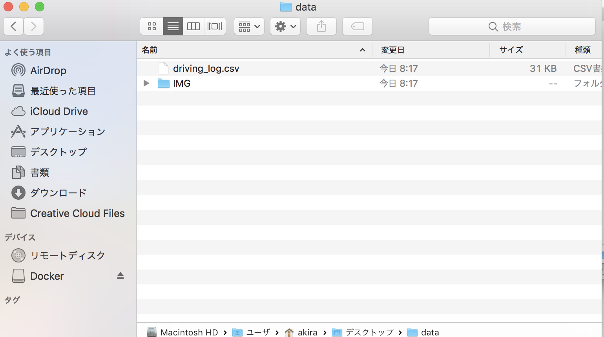

# Emulator

下記レポジトリより、各環境のエミュレータをダウンロード。

https://github.com/ymshao/End-to-End-Learning-for-Self-Driving-Cars

## Datasetの作成

Emulatorを起動します。



データ・セットを作成するには、Training Modeを起動します。



Recordを押すとデータセットのフォルダを選択する画面がでてきます。





再び、Recordを押すとデータセットの作成が始まります。データ・セットの作成中は、Recorndingの記述にかわります。



データセットの作成を終わる場合は、Stopを押します。



## 作成されるデータ・セット

作成されるデータ・セットは以下のフォルダに作成されます。



### driving_log.csv

> center,left,right,steering,throttle,brake,speed

```json
center,left,right,steering,throttle,brake,speed
IMG/center_2016_12_01_13_30_48_287.jpg, IMG/left_2016_12_01_13_30_48_287.jpg, IMG/right_2016_12_01_13_30_48_287.jpg, 0, 0, 0, 22.14829
IMG/center_2016_12_01_13_30_48_404.jpg, IMG/left_2016_12_01_13_30_48_404.jpg, IMG/right_2016_12_01_13_30_48_404.jpg, 0, 0, 0, 21.87963
IMG/center_2016_12_01_13_31_12_937.jpg, IMG/left_2016_12_01_13_31_12_937.jpg, IMG/right_2016_12_01_13_31_12_937.jpg, 0, 0, 0, 1.453011
IMG/center_2016_12_01_13_31_13_037.jpg, IMG/left_2016_12_01_13_31_13_037.jpg, IMG/right_2016_12_01_13_31_13_037.jpg, 0, 0, 0, 1.438419
```

### IMG

IMGフォルダには、右、中央、左の画像が保存されていきます。


