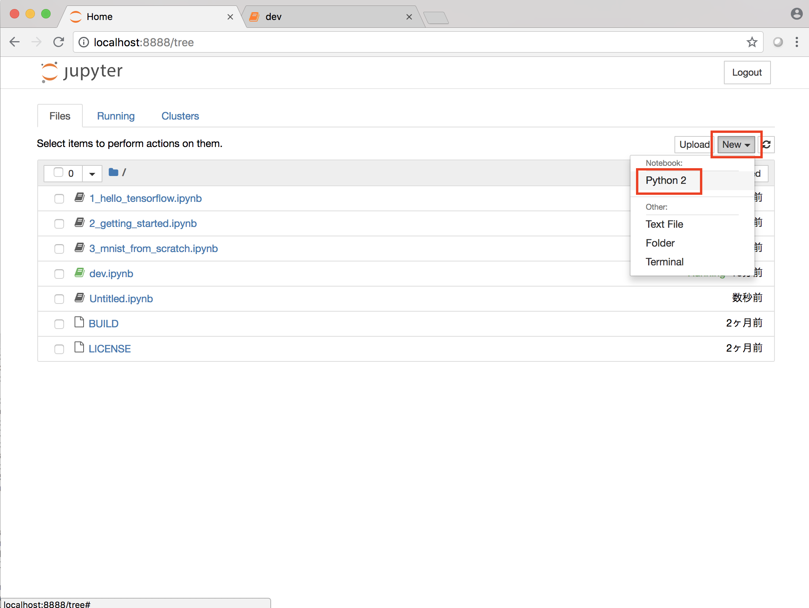
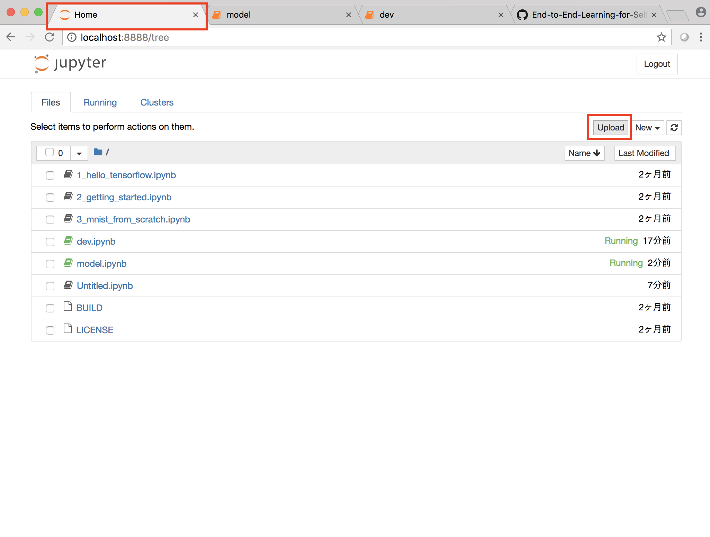
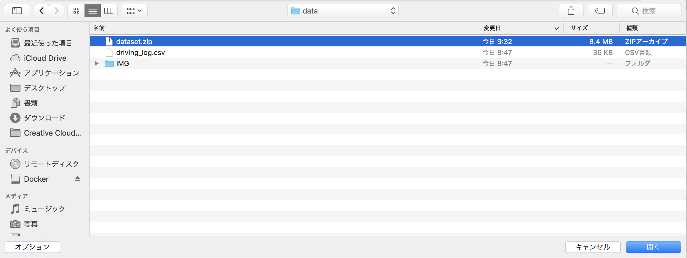
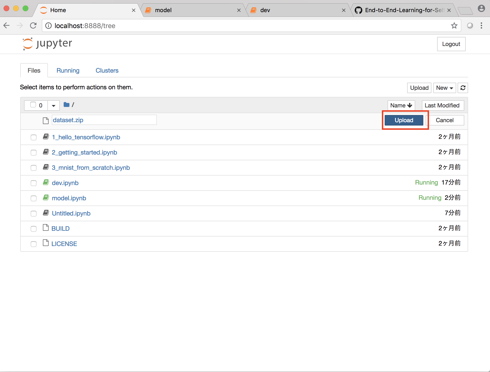
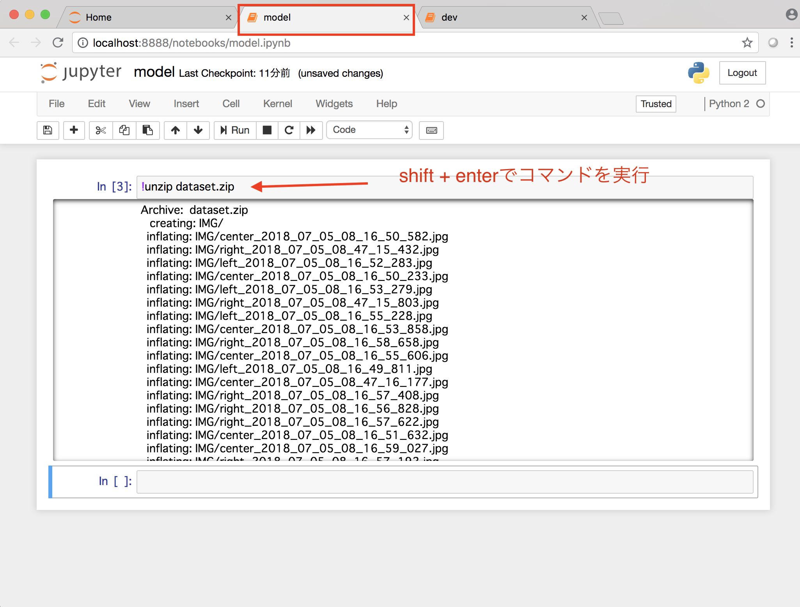
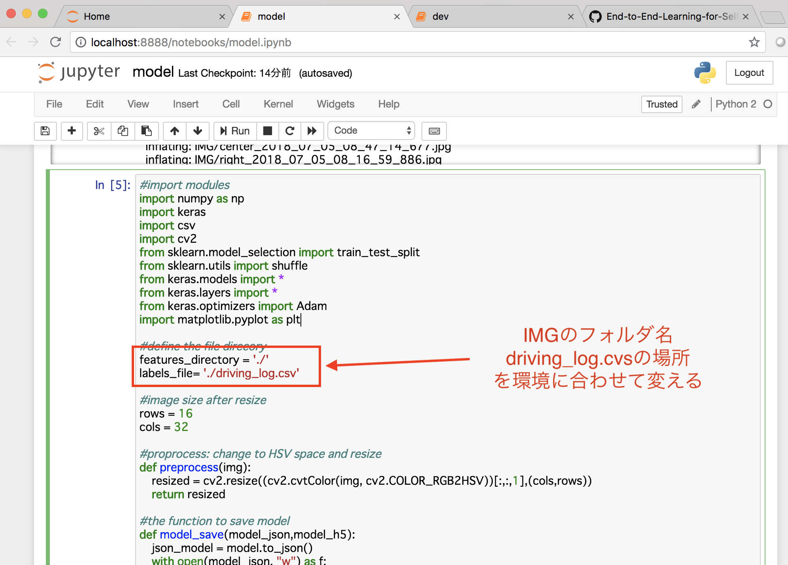

# Model

## Notebookの作成




## DatasetのUpload








## Datasetの解凍



## Modelの実行

https://github.com/ymshao/End-to-End-Learning-for-Self-Driving-Cars/blob/master/model.py

より

```python
#import modules
import numpy as np
import keras
import csv
import cv2
from sklearn.model_selection import train_test_split
from sklearn.utils import shuffle
from keras.models import *
from keras.layers import *
from keras.optimizers import Adam
import matplotlib.pyplot as plt

#define the file direcory
features_directory = './'
labels_file= './driving_log.csv'

#image size after resize
rows = 16
cols = 32

#proprocess: change to HSV space and resize
def preprocess(img):
    resized = cv2.resize((cv2.cvtColor(img, cv2.COLOR_RGB2HSV))[:,:,1],(cols,rows))
    return resized

#the function to save model
def model_save(model_json,model_h5):
    json_model = model.to_json()
    with open(model_json, "w") as f:
        f.write(json_model)
    model.save_weights(model_h5)    

#load the left center and right camera data, shift (-+)delta for left and right camear
def data_loading(delta):
    logs = []
    features = []
    labels = []
    with open(labels_file,'rt') as f:
        reader = csv.reader(f)
        for line in reader:
            logs.append(line)
        log_labels = logs.pop(0)

    for i in range(len(logs)):
        for j in range(3):
            img_path = logs[i][j]
            img_path = features_directory+'IMG'+(img_path.split('IMG')[1]).strip()
            img = plt.imread(img_path)
            features.append(preprocess(img))
            if j == 0:
                labels.append(float(logs[i][3]))
            elif j == 1:
                labels.append(float(logs[i][3]) + delta)
            else:
                labels.append(float(logs[i][3]) - delta)
    return features, labels

#load the data and transform to numpy array
#very important parameter, defining the shift variable for left and righ steering angle
delta = 0.2
features, labels = data_loading(delta)

features = np.array(features).astype('float32')
labels = np.array(labels).astype('float32')

print(features.shape)

#augment the data by horizontal flipping the image
features = np.append(features,features[:,:,::-1],axis=0)
labels = np.append(labels,-labels,axis=0)

# shuffle the data and split to train and validation 
features, labels = shuffle(features, labels)
train_features, test_features, train_labels, test_labels = train_test_split(features, labels, random_state=0, test_size=0.1)

#reshape the data  to feed into the network
train_features = train_features.reshape(train_features.shape[0], rows, cols, 1)
test_features = test_features.reshape(test_features.shape[0], rows, cols, 1)

#define the model
def steering_model():
    model = Sequential()
    model.add(Lambda(lambda x: x/127.5 - 1.,input_shape=(16,32,1)))	

    model.add(Convolution2D(8, 3, 3, init='normal',border_mode='valid'))
    model.add(Activation('relu'))
    model.add(MaxPooling2D((2,2),border_mode='valid'))

    model.add(Convolution2D(8, 3, 3,init='normal',border_mode='valid'))
    model.add(Activation('relu'))
    model.add(MaxPooling2D((2,2),border_mode='valid'))

    model.add(Dropout(0.2))
    model.add(Flatten())
    model.add(Dense(50))
    model.add(Activation('relu'))
    model.add(Dense(1))

    model.summary()
    return model

#optimize
model = steering_model()
adam = Adam(lr=0.001, beta_1=0.9, beta_2=0.999, epsilon=1e-08, decay=0.0)
model.compile(loss='mean_squared_error',optimizer='adam')
history = model.fit(train_features, train_labels,batch_size=128, nb_epoch=10,verbose=1, validation_data=(test_features, test_labels))

#save the model architecture and parameters
model_json = './model.json'
model_h5 = './model.h5'
model_save(model_json,model_h5)
```

## 学習済みモデル

model.json, model.h5ができれば成功


